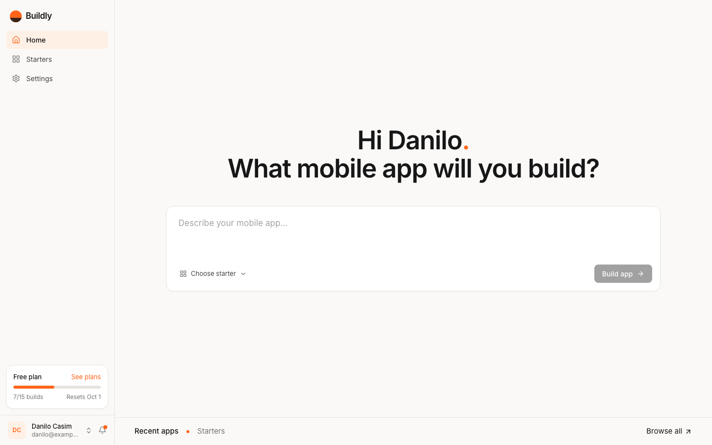
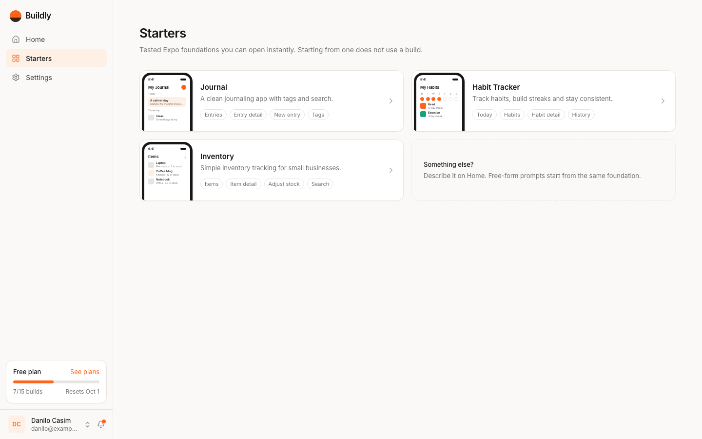
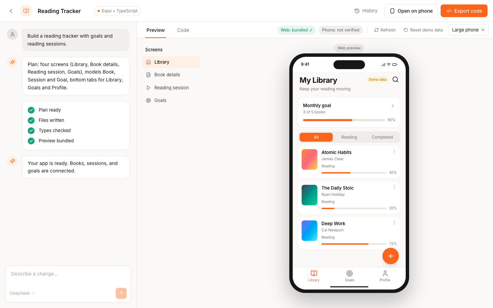
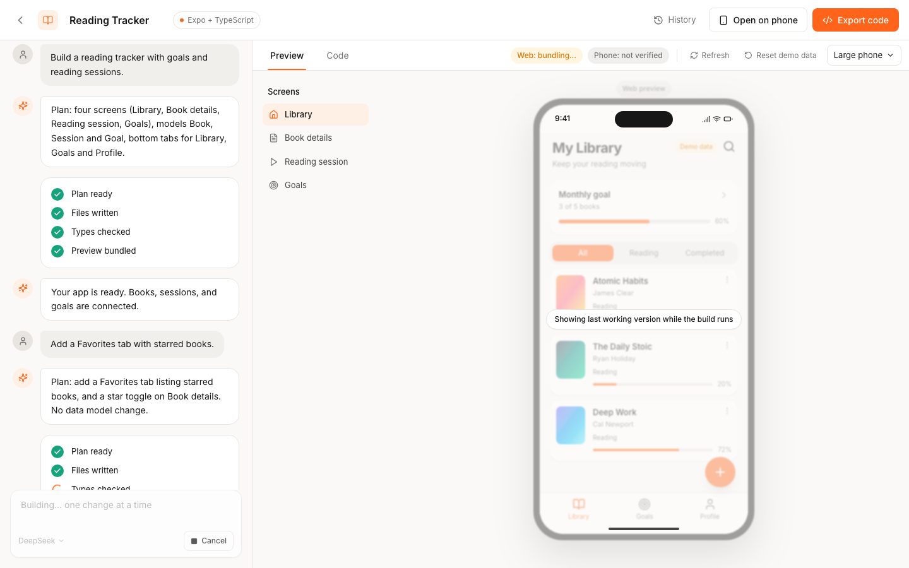
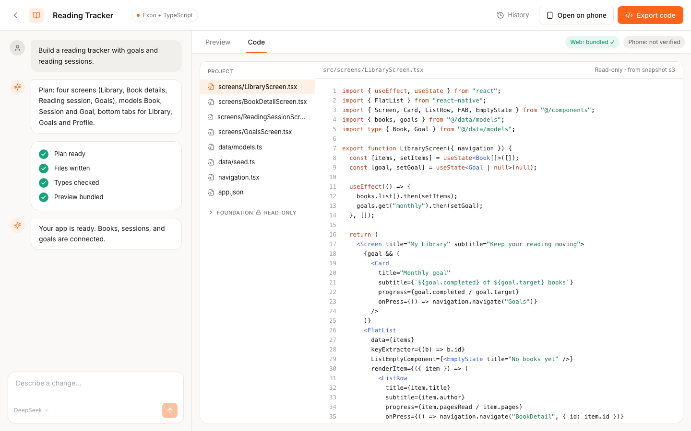
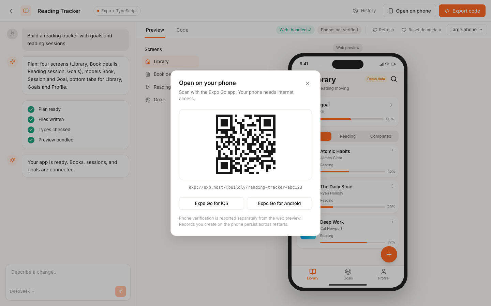
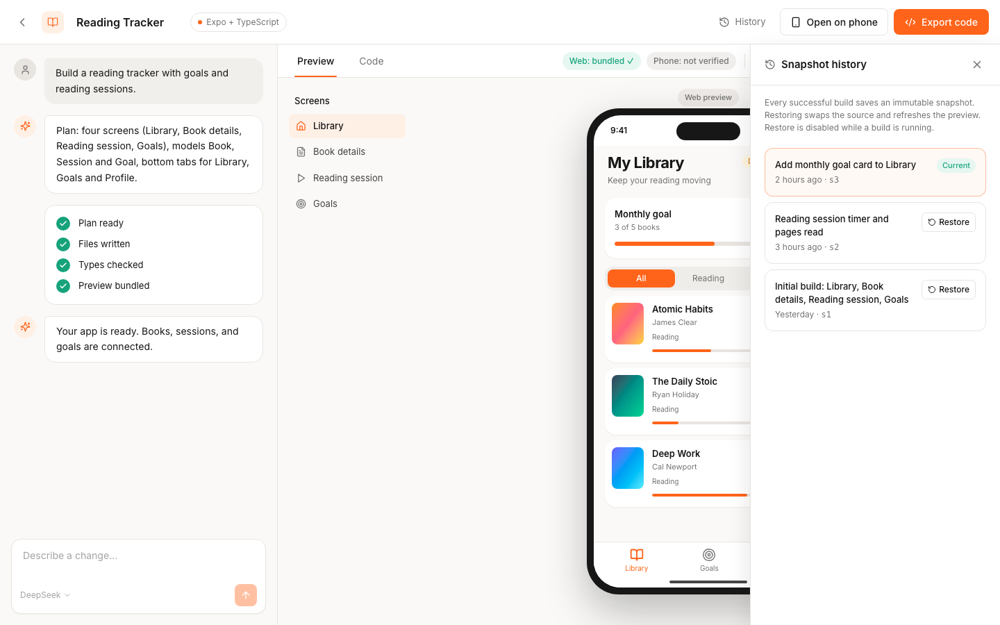
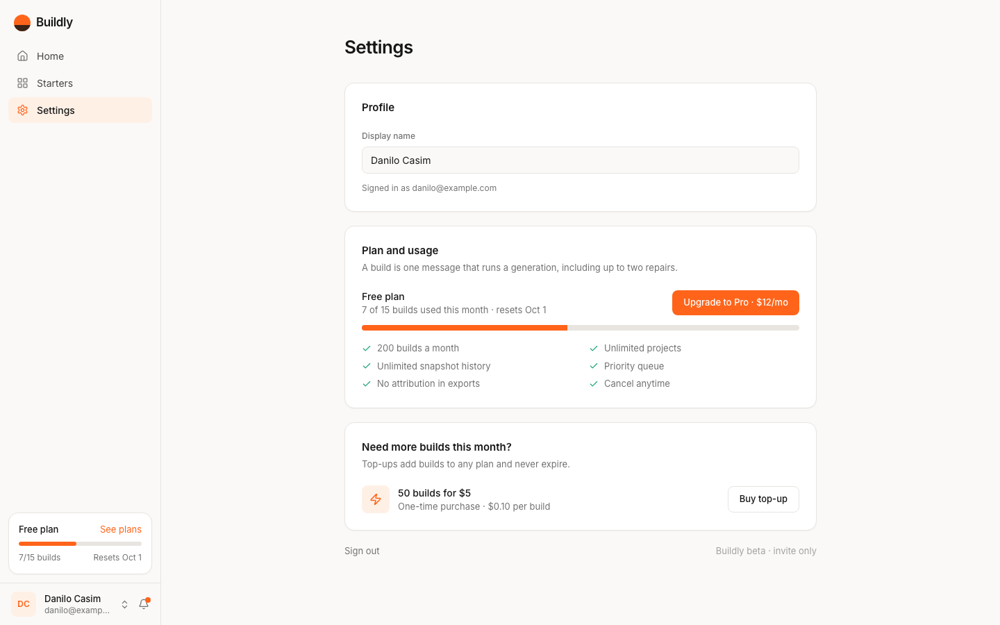

# Design mockup

A click-through Next.js mockup of what Buildly looks like once every task in [`TODO.md`](TODO.md) is done. It uses static mock data and no backend. The visual direction follows the brief (section 3) and the two reference images: the App Studio Home and Workspace concept, and the Base44 dashboard for sidebar, greeting, and account footer.

- Source: [`mockup/`](mockup/) (Next.js 15 App Router, Tailwind v4, lucide icons, Inter)
- Screenshots: [`screens/`](screens/) at 1440×900

## Run it

```bash
cd .plan/mvp/mockup
pnpm install
pnpm dev          # http://localhost:3100
```

`pnpm build` and `pnpm typecheck` both pass. Screenshots were captured with headless Chrome against a production build that uses its own output directory, so it can run while `pnpm dev` is up:

```bash
pnpm build:shots && pnpm start:shots &     # serves on http://localhost:3101 from .next-prod
"/Applications/Google Chrome.app/Contents/MacOS/Google Chrome" --headless=new --window-size=1440,900 \
  --virtual-time-budget=8000 --screenshot=../screens/home.png http://localhost:3101/
```

## Screens

| Screenshot | Route | What it shows | TODO slices |
| --- | --- | --- | --- |
|  | `/` | Sidebar (Home, Starters, Settings, usage card, account footer); greeting and composer centered in the viewport like the Base44 reference; a bottom strip with Recent apps / Starters tabs and Browse all; the selected grid scrolls in below the fold | 5.1, 6.1, 6.2 |
|  | `/starters` | Starter gallery with screen chips; opening one does not use a build | 6.2 |
|  | `/app/reading-tracker` | Toolbar (back, editable name, Expo + TypeScript badge, History, Open on phone, Export code), chat with plan and verified progress steps, Preview tab with Web/Phone status chips, Refresh, Reset demo data, viewport preset, screen list, phone frame with the generated app and a Demo data pill | 5.2, 5.3, 5.6, 5.7 |
|  | `/app/reading-tracker?building=1` | A follow-up edit in progress: steps tick over only as server events arrive, composer disabled with Cancel, preview dimmed showing the last working version | 5.2.2, 5.2.3 |
|  | `/app/reading-tracker?tab=code` | Read-only file tree with project files and a collapsed read-only Foundation group, highlighted source | 5.5 |
|  | `/app/reading-tracker?phone=1` | QR modal for Expo Go with install links and the internet-access note | 5.4 |
|  | `/app/reading-tracker?history=1` | Snapshot history drawer with Current badge and Restore | 5.7.2 |
|  | `/settings` | Display name, plan and usage with the Pro upsell, top-up, sign out | 6.4 |

## Interactions that work in the mockup

- Composer: Build app is disabled until there is a prompt or a starter; the starter menu adds a removable chip; ⌘↵ builds.
- Chat: sending a change runs a simulated build (about four seconds) that advances the four steps, disables the composer, dims the preview, and can be cancelled.
- Preview: viewport preset toggles the phone size; screen list highlights the selected screen.
- Code tab, Open on phone modal, and History drawer open from the toolbar or by URL.
- Project name is editable inline.

## Deliberate differences from the reference images

- **Starters** replaces "Templates" and "My Apps" is folded into Recent apps on Home (brief section 0).
- Progress steps are `Plan ready`, `Files written`, `Types checked`, `Preview bundled`, matching the server-driven events in ARCHITECTURE.md, instead of the concept's "Screens created / Local data connected / Checks passed".
- Web and phone verification are shown as separate chips (brief section 12).
- The sidebar carries a Free-plan usage card and account footer from the Base44 reference; no promotional countdown banner (brief section 3).
- A "Demo data" pill is visible inside the generated app while seed records exist (TODO 2.2.3).

## Reusing the mockup in the real app

The components are intentionally close to the planned `apps/web` structure: `Sidebar`, `Composer`, `StarterCard`, and the `workspace/*` components can be moved into `apps/web/components` when Phase 5 starts, with mock data replaced by the API routes in ARCHITECTURE.md section 7. The phone frame will wrap the Snack web player iframe instead of `ReadingTrackerApp`.
